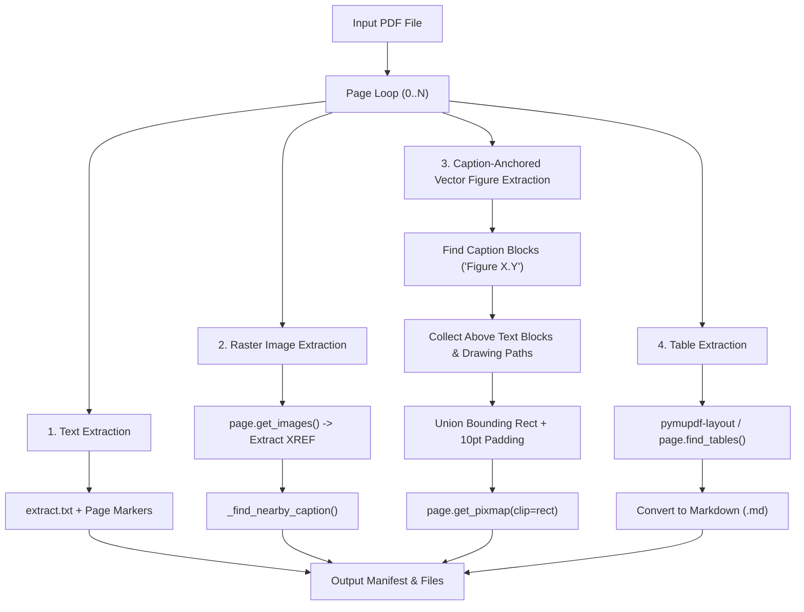

# 📄 Advanced PDF Text & Image Extractor

> A powerful, beginner-friendly Python tool that extracts **everything** from PDF files — plain text, photos, vector diagrams (flowcharts, pie charts, chemical structures), and tables — with automatic caption matching and zero missing labels!

---

## 🌟 What Does This Tool Do?

Most PDF tools struggle with vector diagrams, flowcharts, or tables, often cropping off labels or skipping non-image figures entirely. This tool fixes that:

- 📝 **Full Text Extraction**: Extracts clean plain text with clear page markers.
- 🖼️ **Embedded Photo Extraction**: Extracts all high-res photos (JPEG/PNG).
- 🎨 **Vector Diagram & Flowchart Capture**: Automatically crops flowcharts, pie charts, and chemical molecules **with all text labels intact**.
- 📊 **Smart Table Detection**: Converts complex tables into clean Markdown (`.md`) format using machine learning layout analysis.
- 🏷️ **Caption Matching**: Links every image and diagram to its exact caption (e.g., `Figure 1.4: Requirements...`).

---

## 🚀 Beginner Quick-Start Guide (Step-by-Step)

No complex configuration needed! Follow these 4 easy steps to run the project.

### Step 1: Clone the Repository
Open your Terminal (Mac/Linux) or Command Prompt / PowerShell (Windows) and run:

```bash
git clone https://github.com/keplar-404/advanced-pdf-text-and-image-extraction.git
cd advanced-pdf-text-and-image-extraction
```

---

### Step 2: Create a Virtual Environment

A virtual environment keeps the project dependencies isolated and clean.

**On Linux / macOS:**
```bash
python3 -m venv .venv
source .venv/bin/activate
```

**On Windows:**
```cmd
python -m venv .venv
.venv\Scripts\activate
```

*(You will see `(.venv)` appear at the start of your terminal prompt).*

---

### Step 3: Install Required Packages

Run this single command to install all dependencies:

```bash
pip install pymupdf pillow pymupdf-layout
```

| Package | What it does |
|---|---|
| `pymupdf` | Parses PDF pages, extracts text, images, and drawings |
| `pillow` | Saves and converts images into PNG/JPEG format |
| `pymupdf-layout` | Machine learning model for advanced table boundary detection |

---

### Step 4: Extract Your PDF!

Run the script on any PDF file:

```bash
python extract_pdf.py path/to/your_document.pdf
```

🎉 **Done!** An output folder named `your_document_extracted/` will be created right next to your PDF.

---

## 📁 What Files Do You Get?

Inside the generated output directory:

```
your_document_extracted/
├── extract.txt                    # Complete plain text of the PDF with page dividers
├── extract_log.txt                # Processing log and timestamps
├── layout.json                    # Column layout details per page
├── drawings.json                  # Vector shape details
├── tables/                        # Markdown files for every table found
│   ├── page016_table01.md
│   └── page038_table01.md
└── extract_images/                # Extracted images and figures
    ├── manifest.json              # Machine-readable JSON index with captions & metadata
    ├── page016_vec01.png          # Complete flowchart (with text labels)
    ├── page025_vec01.png          # Complete pie chart (with percentage labels)
    └── page024_img01_xref137.png  # Embedded photos/raster images
```

---

## ⚙️ Command-Line Options

You can customize how the script runs with optional flags:

```bash
# 1. Custom output directory
python extract_pdf.py my_doc.pdf --output-dir /path/to/my_output/

# 2. Filter out tiny icon pixels (default minimum size is 8px)
python extract_pdf.py my_doc.pdf --min-dim 16
```

---

## 🧠 Deep Dive: Technical Architecture (For Developers)

If you are a developer looking to understand how the extraction pipeline works under the hood, here is the architecture breakdown:

### Pipeline Overview



### Key Algorithms Explained

1. **Caption-Anchored Figure Extraction (`_collect_figure_regions_from_captions`)**:
   - Rather than naive spatial clustering of drawing paths (which fragments figures into dozens of sub-images), the tool scans for caption text blocks (`Figure X.Y`).
   - It works backwards from the caption: gathering all short text label blocks and vector drawing paths in the same column zone above the caption.
   - It computes the union bounding rectangle, applies 10 pt padding, and renders a single, clean, fully-labeled figure image.

2. **Non-Breaking Space Normalization (`_NON_BREAKING_TRANS`)**:
   - Uses `str.maketrans` to convert non-breaking spaces (`\xa0`) and en-spaces (`\u2002`) to standard spaces prior to regex evaluation.
   - Ensures multi-word section numbers and figure titles like `Figure\xa01.4` match cleanly.

3. **Raster Image Overlap Filter (`_has_raster_image_already`)**:
   - Prevents duplicate renders by measuring area intersection (`rect & region_rect`). If a raster image covers >70% of a vector region, the vector render step skips it.

4. **Structured Manifest Output (`manifest.json`)**:
   - Every extracted asset is registered in `manifest.json` with page number, resolution, dimensions, bounding box coordinates, drawing count, and associated `nearby_caption`.

---

## 🧪 Running Unit Tests & Fixtures

The repository includes standalone fixture scripts to verify extraction correctness:

```bash
# Build test PDF fixtures
python make_fixture.py
python make_overlay_fixture.py
python make_realworld_fixture.py

# Run extractor & verification suite
python extract_pdf.py sample.pdf
python test_extract.py sample_extracted/extract_images
```

---

## 📄 License

MIT License — free for personal, academic, and commercial use.